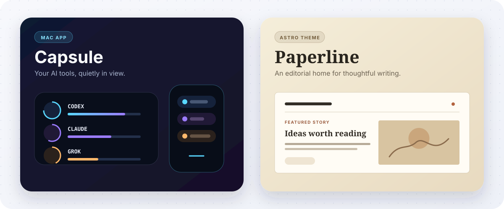

  

  <a href="https://sanam.id">Website</a>
  &nbsp;·&nbsp;
  <a href="https://slashism.com">Writing</a>
  &nbsp;·&nbsp;
  <a href="https://x.com/aghorism">X</a>
  &nbsp;·&nbsp;
  <a href="https://www.linkedin.com/in/pankajsanam">LinkedIn</a>

## I build from idea to production

I am a technology lead and product builder who enjoys turning useful ideas into focused software. I work across product thinking, architecture, interfaces, infrastructure, and the details that make software pleasant to use.

My current interests sit at the intersection of developer experience, AI-assisted workflows, productivity, and thoughtful publishing.

<table>
  <tr>
    <td width="33%" valign="top">
      <strong>01 · Building</strong>  
      Focused tools that help people work with less friction and more clarity.
    </td>
    <td width="33%" valign="top">
      <strong>02 · Exploring</strong>  
      Better interfaces and workflows for people building alongside AI agents.
    </td>
    <td width="33%" valign="top">
      <strong>03 · Writing</strong>  
      Practical lessons on software, systems, architecture, AI, and cloud engineering.
    </td>
  </tr>
</table>

## Selected work

  

<table>
  <tr>
    <td width="33%" valign="top">
      <h3>Capsule</h3>
      
A quiet edge dock for AI coding tools on macOS. It keeps usage limits, local agent activity, reset times, and token totals visible without pulling you out of your work.

      

        <a href="https://github.com/antick/capsule"><strong>Source</strong></a>
        &nbsp;·&nbsp;
        <a href="https://github.com/antick/capsule/releases/latest"><strong>Download</strong></a>
      

    </td>
    <td width="33%" valign="top">
      <h3>Paperline</h3>
      
An open-source Astro blog theme with an editorial layout, thoughtful typography, search, organized archives, rich reading tools, and a warm paper-inspired palette.

      

        <a href="https://github.com/antick/astro-paperline"><strong>Source</strong></a>
        &nbsp;·&nbsp;
        <a href="https://paperline.potion.sh"><strong>Live demo</strong></a>
      

    </td>
    <td width="33%" valign="top">
      <h3>Netflix Hidden Categories</h3>
      
An open-source Chrome extension that adds a searchable category menu to Netflix, making hundreds of hidden genres easy to browse, search, and save.

      

        <a href="https://github.com/antick/netflix-categories-chrome"><strong>Source</strong></a>
        &nbsp;·&nbsp;
        <a href="https://chromewebstore.google.com/detail/netflix-hidden-categories/ahpajhekpgjoijmcomaffmljeafacemc"><strong>Install</strong></a>
      

    </td>
  </tr>
</table>

## Tools I enjoy working with

  
  
  
  
  
  

I also work with Node.js, Python, Hono, Elysia, NestJS, Tailwind CSS, TanStack, MongoDB, Valkey, Nginx, CI/CD, and DigitalOcean. The exact stack changes with the problem.

## Writing and learning

At [Slashism](https://slashism.com), I publish deep tutorials and practical guides for people who build software. The subjects range from programming and AI engineering to system design, databases, DevOps, and cloud infrastructure.

  <a href="https://slashism.com/courses"><strong>Explore courses</strong></a>
  &nbsp;·&nbsp;
  <a href="https://slashism.com/tutorials"><strong>Read tutorials</strong></a>
  &nbsp;·&nbsp;
  <a href="https://slashism.com/guides"><strong>Browse guides</strong></a>

## How I work

<table>
  <tr>
    <td width="33%" align="center"><strong>Think in systems</strong> Understand the whole before polishing the parts.</td>
    <td width="33%" align="center"><strong>Keep it useful</strong> Clarity and utility come before novelty.</td>
    <td width="33%" align="center"><strong>Learn by shipping</strong> Real feedback beats prolonged speculation.</td>
  </tr>
</table>

Beyond software, daily meditation and spiritual practice help me cultivate the focus, discipline, and steadiness I bring to my work.

## Let us connect

I enjoy conversations about product engineering, developer tools, AI-assisted workflows, architecture, and the craft of building useful things.

  
  
  

  Build with intent. Keep learning. Leave things better than you found them.

